# System Architecture

## 🏗️ Complete Architecture Diagram

```mermaid
graph TB
    %% User Layer
    User[👤 User] --> Browser[🌐 Web Browser]

    %% Frontend Layer
    Browser --> S3[📦 S3 Static Website<br/>- index.html<br/>- events.html<br/>- login.html<br/>- register.html<br/>- invite.html<br/>- script.js]

    %% Authentication Layer
    Browser --> Cognito[🔐 AWS Cognito<br/>User Pool<br/>- JWT Tokens<br/>- Email Verification<br/>- Password Policies]

    %% API Gateway Layer
    S3 --> APIGW[🚪 API Gateway<br/>REST API Endpoints]

    %% API Endpoints
    APIGW --> Events_POST[POST /events<br/>Create Event]
    APIGW --> Events_GET[GET /events<br/>List Events]
    APIGW --> Events_DELETE[DELETE /events/{id}<br/>Delete Event]
    APIGW --> Invites_POST[POST /invitations<br/>Generate Invitation]
    APIGW --> Invites_GET[GET /invitations/{token}<br/>Validate Invitation]

    %% Lambda Functions
    Events_POST --> Lambda1[⚡ sendEventNotification<br/>Lambda Function]
    Events_GET --> Lambda2[⚡ listEventsNotification<br/>Lambda Function]
    Events_DELETE --> Lambda3[⚡ deleteEventNotification<br/>Lambda Function]
    Invites_POST --> Lambda4[⚡ generateInvitation<br/>Lambda Function]
    Invites_GET --> Lambda5[⚡ validateInvitation<br/>Lambda Function]

    %% Database Layer
    Lambda1 --> DDB1[🗄️ DynamoDB<br/>events-table<br/>- id (PK)<br/>- title<br/>- date<br/>- address<br/>- description<br/>- creator_name]
    Lambda2 --> DDB1
    Lambda3 --> DDB1

    Lambda4 --> DDB2[🗄️ DynamoDB<br/>invitations-table<br/>- token (PK)<br/>- inviter_email<br/>- expires_at<br/>- used<br/>- created_at]
    Lambda5 --> DDB2

    %% Notification Layer
    Lambda1 --> SNS[📧 SNS Topic<br/>Email Notifications<br/>- New Event Alerts]

    %% External Services
    S3 --> Maps[🗺️ Google Maps<br/>Embedded Maps<br/>Location Display]
    Browser --> GoogleCal[📅 Google Calendar<br/>Add to Calendar]
    Browser --> AppleCal[🍎 Apple Calendar<br/>ICS Download]

    %% IAM Security
    Lambda1 -.-> IAM[🔒 IAM Roles<br/>- DynamoDB Access<br/>- SNS Publish<br/>- CloudWatch Logs]
    Lambda2 -.-> IAM
    Lambda3 -.-> IAM
    Lambda4 -.-> IAM
    Lambda5 -.-> IAM

    %% Styling
    classDef frontend fill:#e1f5fe
    classDef auth fill:#f3e5f5
    classDef api fill:#e8f5e8
    classDef lambda fill:#fff3e0
    classDef database fill:#fce4ec
    classDef external fill:#f1f8e9

    class Browser,S3 frontend
    class Cognito auth
    class APIGW,Events_POST,Events_GET,Events_DELETE,Invites_POST,Invites_GET api
    class Lambda1,Lambda2,Lambda3,Lambda4,Lambda5 lambda
    class DDB1,DDB2 database
    class Maps,GoogleCal,AppleCal,SNS external
```

## 🔄 Data Flow Diagrams

### User Registration Flow


### Event Management Flow

```mermaid
sequenceDiagram
    participant U as User
    participant B as Browser
    participant S3 as S3 Website
    participant C as Cognito
    participant API as API Gateway
    participant L1 as sendEventNotification λ
    participant L2 as listEventsNotification λ
    participant L3 as deleteEventNotification λ
    participant DDB as events-table
    participant SNS as SNS Topic

    Note over U,SNS: Authentication
    U->>B: Login credentials
    B->>C: Authenticate user
    C->>B: JWT tokens
    B->>B: Store tokens locally

    Note over U,SNS: Create Event
    U->>B: Fill event form
    B->>API: POST /events (with JWT)
    API->>L1: Invoke sendEventNotification
    L1->>DDB: Store event data
    L1->>SNS: Send notification
    L1->>API: Success response
    API->>B: Event created

    Note over U,SNS: View Events
    B->>API: GET /events
    API->>L2: Invoke listEventsNotification
    L2->>DDB: Query all events
    L2->>API: Events array
    API->>B: Events data
    B->>U: Display events (sorted by date)

    Note over U,SNS: Delete Event
    U->>B: Click delete button
    B->>API: DELETE /events/{id}
    API->>L3: Invoke deleteEventNotification
    L3->>DDB: Remove event
    L3->>API: Success response
    API->>B: Event deleted
```


## 🔧 Component Details

### Frontend Components
| File | Purpose | Key Features |
|------|---------|--------------|
| `index.html` | Event creation form | Form validation, date picker |
| `events.html` | Event dashboard | Search, filter, calendar view |
| `login.html` | User authentication | Cognito integration, JWT handling |
| `register.html` | User registration | Invitation token validation |
| `invite.html` | Invitation generation | Email input, link sharing |
| `script.js` | Main application logic | API calls, event handling, calendar integration |

### Lambda Functions
| Function | Trigger | Purpose | Database Access |
|----------|---------|---------|-----------------|
| `sendEventNotification` | POST /events | Create new event | Write to events-table |
| `listEventsNotification` | GET /events | Retrieve all events | Read from events-table |
| `deleteEventNotification` | DELETE /events/{id} | Remove event | Delete from events-table |
| `generateInvitation` | POST /invitations | Create invitation token | Write to invitations-table |
| `validateInvitation` | GET /invitations/{token} | Validate invitation | Read from invitations-table |

### API Endpoints
| Method | Endpoint | Lambda Function | Purpose |
|--------|----------|-----------------|---------|
| POST | `/events` | sendEventNotification | Create new event |
| GET | `/events` | listEventsNotification | List all events |
| DELETE | `/events/{id}` | deleteEventNotification | Delete specific event |
| POST | `/invitations` | generateInvitation | Generate invitation link |
| GET | `/invitations/{token}` | validateInvitation | Validate invitation token |

### Database Schema

#### events-table (DynamoDB)
```json
{
  "id": "uuid-string (PK)",
  "event_id": "uuid-string",
  "title": "string",
  "date": "ISO-8601 datetime",
  "address": "string",
  "description": "string",
  "creator_name": "string",
  "created_at": "ISO-8601 datetime"
}
```

#### invitations-table (DynamoDB)
```json
{
  "token": "uuid-string (PK)",
  "inviter_email": "string",
  "expires_at": "ISO-8601 datetime",
  "used": "boolean",
  "created_at": "ISO-8601 datetime"
}
```

## 🔒 Security Architecture

```mermaid
graph LR
    subgraph "Security Layers"
        A[🌐 Frontend] --> B[🔐 Cognito JWT]
        B --> C[🚪 API Gateway]
        C --> D[⚡ Lambda Functions]
        D --> E[🗄️ DynamoDB]
    end

    subgraph "IAM Permissions"
        F[📋 Lambda Execution Role]
        G[📊 DynamoDB Access Policy]
        H[📧 SNS Publish Policy]
        I[📝 CloudWatch Logs Policy]
    end

    D -.-> F
    F -.-> G
    F -.-> H
    F -.-> I
```



### Security Features
- **Authentication**: AWS Cognito with JWT tokens
- **Authorization**: Function-level access control
- **CORS**: Properly configured for cross-origin requests
- **Input Validation**: Server-side validation in Lambda functions
- **Invitation System**: Token-based registration with expiry
- **IAM**: Least privilege access for all resources

## 📊 Monitoring & Observability

```mermaid
graph TB
    subgraph "Application"
        A[⚡ Lambda Functions]
        B[🚪 API Gateway]
        C[🗄️ DynamoDB]
    end

    subgraph "Monitoring"
        D[📊 CloudWatch Metrics]
        E[📝 CloudWatch Logs]
        F[🔍 X-Ray Tracing]
        G[🚨 CloudWatch Alarms]
    end

    A --> D
    A --> E
    B --> D
    B --> E
    C --> D

    D --> G
    A -.-> F
    B -.-> F
```



### Monitoring Capabilities
- **Lambda Metrics**: Duration, errors, invocations
- **API Gateway Metrics**: Request count, latency, errors
- **DynamoDB Metrics**: Read/write capacity, throttling
- **Custom Logs**: Application-specific logging
- **Distributed Tracing**: Request flow across services

## 💰 Cost Architecture

### Cost Components
| Service | Pricing Model | Estimated Monthly Cost |
|---------|---------------|------------------------|
| Lambda | Per invocation + duration | $1-2 |
| DynamoDB | On-demand reads/writes | $1-3 |
| API Gateway | Per request | $3-5 |
| S3 | Storage + requests | $0.50 |
| Cognito | Per active user | $0-5 (50k free) |
| SNS | Per message | $0.10 |
| **Total** | | **$5-15** |

### Cost Optimization Features
- **Serverless**: Pay only for actual usage
- **On-demand DynamoDB**: No provisioned capacity
- **S3 Static Hosting**: Minimal storage costs
- **Free Tier Eligible**: Most services included in AWS free tier
